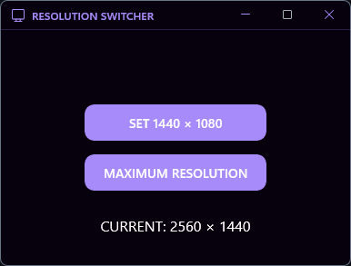

# Resolution Switcher

Eine moderne Windows 11 App zum schnellen Wechseln der Bildschirmauflösung. Perfekt für Streamer, Content Creator oder jeden, der häufig die Bildschirmauflösung ändern muss.

## Features

- Schnelles Umschalten auf 1440×1080 Auflösung (ideal zum Streamen)
- Ein-Klick-Wiederherstellung der maximalen Auflösung
- Saubere, moderne Benutzeroberfläche im Windows 11-Stil
- Minimaler Speicherbedarf

## Anforderungen

- Windows 10 (build 17763) oder Windows 11

## Installation

### Option 1: Self-Contained Executable (Empfohlen)
1. Besuchen Sie die [Releases](https://github.com/Gustav04szb/resolution-switcher/releases) Seite
2. Laden Sie die neueste "Strecher_x64_selfcontained_fixed.zip" Datei herunter
3. Entpacken Sie die ZIP-Datei
4. Führen Sie die Strecher.exe aus (keine zusätzliche Installation erforderlich)

### Option 2: Von Quelle bauen
1. Klonen Sie dieses Repository
2. Öffnen Sie die Lösung in Visual Studio 2022
3. Bauen Sie die Lösung (benötigt Windows App SDK 1.7)
4. Führen Sie die App aus

## Verwendung

1. Starten Sie die App
2. Klicken Sie auf "SET 1440 × 1080", um zur 1440×1080 Auflösung zu wechseln
3. Klicken Sie auf "MAXIMUM RESOLUTION", um Ihre maximale Bildschirmauflösung wiederherzustellen

## Screenshots

## Lizenz

Dieses Projekt ist unter der MIT-Lizenz lizenziert - siehe die LICENSE-Datei für Details.

## Autor

Erstellt von Gustav Schwarzbach 
